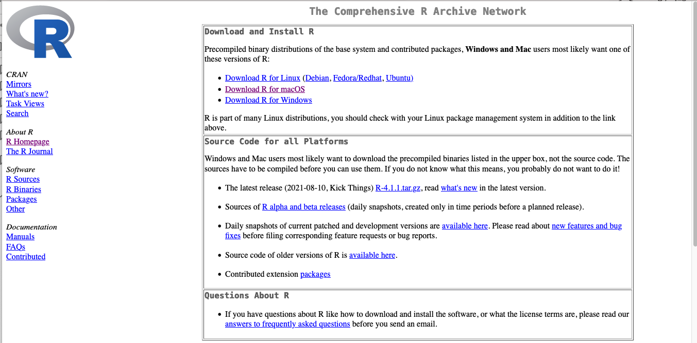
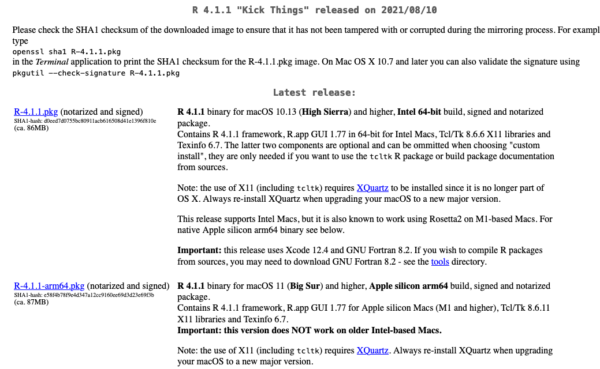
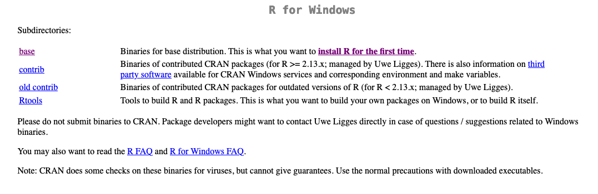

```{r setup, include=FALSE}
knitr::opts_chunk$set(echo = FALSE)
```

## First Install R 

Go to https://mirror.las.iastate.edu/CRAN/




## Click on the link for your machine in the Download and Install Section 


## For Mac Users Install R 4.1.1 




## For Windows Users Install R 4.1.1.



## Install RStudio after Installing R 

Go to https://www.rstudio.com/products/rstudio/download/

## Download RStudio Desktop 

Make sure to download the right one for your machine 


