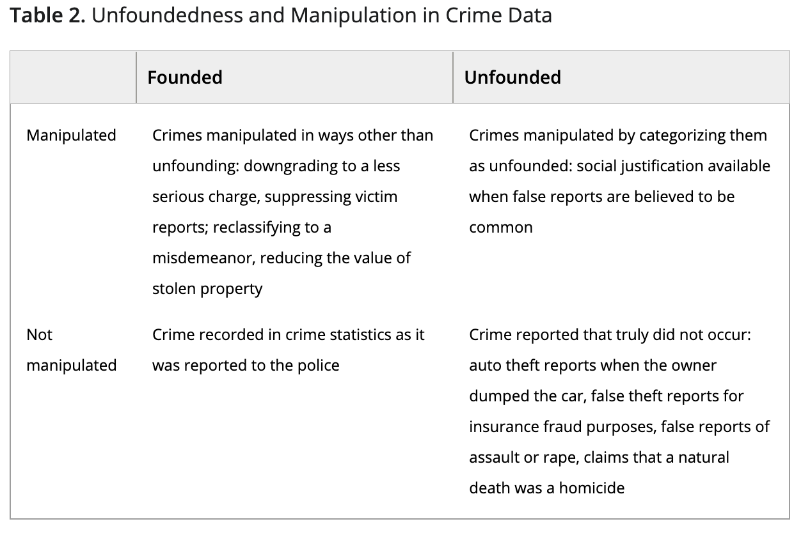
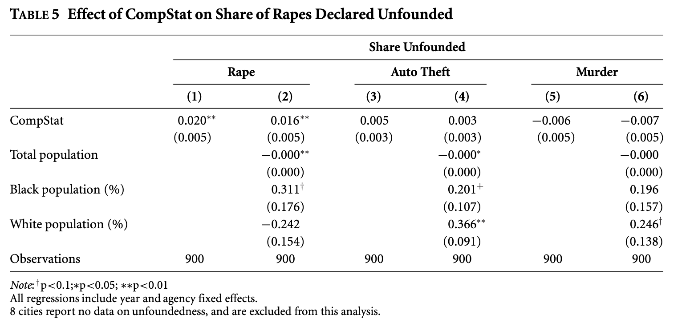

```{r setup, include=FALSE}
options(htmltools.dir.version = FALSE,scipen = 9)
knitr::opts_chunk$set(
  fig.width=9, fig.height=3.5, fig.retina=3,
  out.width = "100%",
  cache = FALSE,
  echo = TRUE,
  message = FALSE, 
  warning = FALSE,
  fig.show = TRUE,
  hiline = TRUE
)
```

```{r xaringan-themer, include=FALSE, warning=FALSE}
library(xaringanthemer)
library(tidyverse)
library(knitr)
library(estimatr)
library(panelsim)
style_mono_light(base_color = "#003262",
                 base_font_size = "25px")
```

## Example 1: Eckhouse (2021)

"Metrics Management and Bureaucratic Accountability: Evidence from Policing"

Government depend on agents to enforce decisions. They may build in metrics to assess these. Eckhouse shows how metrics management encourages bureaucrats to prioritize work with rapid measurable results and deprioritize complex and uncertain projects 

She focuses on police departments and the use of CompStat

---
## Example 1: Eckhouse (2021)



???

Data manipulation has been identified locally in a variety of crimes: homicides, assault, and sexual assault (Bernstein and Isackson 2014; Poston and Rubin 2014; Rayman 2013). Measuring manipulation is challenging because researchers have access only to the altered data. However, I identify a strategy for identifying data manipulation in the case of rape reports: reclassifying rapes as “unfounded.”

This strategy takes advantage of a socially constructed idea unique to rape: the common but erroneous belief that rape is prone to false allegations and unfounded complaints (Spohn and Horney 2013). This allows police to alter rape statistics—unlike numbers for assaults, homicides, motor vehicle theft, and other serious crimes—by designating rapes “unfounded,” a category reported in FBI data. In a comprehensive survey of problems in rape statistics, Yung (2014) finds many small studies in which police classified “ordinary rape complaints” with intoxicated victims as “unfounded,” and evidence that police in large city departments used unfoundedness to reduce crime measures.

Eckhouse use policing as a case study because the stakes are high: the consequences of shirking, which metrics management aims to prevent, are serious, as are the consequences of increases in minor arrests and data manipulation. People's lives and civic participation may be forever altered by an arrest (Kohler-Hausmann 2013; Walker 2018; White 2019), or by the lack of state consequences for serious crimes when they are downgraded or hidden (Leovy 2015).

data manipulation also has massive substantive consequences. Media accounts of the New York, Chicago, and Los Angeles police departments have described police downgrading of serious crimes. In New York, a string of related sexual assaults occurred in a single neighborhood in 2002. Under pressure to post weekly crime reductions, police recorded the assaults as criminal trespassing or other misdemeanors. Over two months, the perpetrator grew bolder in his methods and targets. The pattern of attacks was not discovered until he was apprehended and confessed, when the detective questioning him looked through the precinct's complaints and found the misclassified incidents (Rayman 2013).

This case exemplifies the real-world consequences of data manipulation by police. Communities are robbed of public safety and access to formal law when officers downgrade complaints.
---

## Example 1: Eckhouse (2021)




???

Compstat is a binary independent variable describing whether a city has adopted CompStat; it is equal to 0 until an agency adopts CompStat, and equal to 1 thereafter. urn:x-wiley:00925853:media:ajps12661:ajps12661-math-0093 is a vector of control variables described for each individual analysis. urn:x-wiley:00925853:media:ajps12661:ajps12661-math-0094 is the agency effect, and urn:x-wiley:00925853:media:ajps12661:ajps12661-math-0095 represents the year effect.

The main threat to the validity of the estimate is omitted variable bias. With city-level fixed effects included, coefficient estimates control for both observed and unobserved differences between cities. I also include year fixed effects because both crime and arrests have substantial temporal variation. 

I use “unfounded” classifications for reported rapes to test for data manipulation. Adopting CompStat is associated with an increase in 1.9 percentage points in the share of rapes designated unfounded (see Table 5). Because the mean share of rapes reported unfounded is 6.8%, adopting CompStat is associated with a 28% increase in the share of rapes reported as unfounded. Some may worry that CompStat would affect the number of rapes committed or reported to police, leading to posttreatment bias because the share of rapes declared unfounded is conditional on the denominator reported. 

---
## Two Way Fixed Effects 

We have been discussing Fixed Effects this week. 

Today we are going to move into an area that has had a flurry of research over the last three years: Two Way Fixed Effects 

Much of this has been related to the Difference in Differences literature, which we will return to later in the semester
---

## Revisiting the Interpretation of FE 

We saw that we transformed the outcome variable and demeaned the explanatory variables. 

The time fixed covariates drop out of the model. 

???

In the case set, when we have country fixed effects for example we subtract out the means across observations within each time point. This time we do not eliminate the time fixed covariate but we do eliminate any variables that vary over time but are fixed WITHIN cases. 

This is the mean-centering approach to fixed effects. 
---

## Revisiting the Interpretation of FE 

We can also think of a data subsetting approach to fixed effects. 

Within the data for one case all variation must occur over time, so a regression coefficient within this subset must the average effect of a unit increase in x on y as each variable changes over time. 


???

The specifics of this approach are explained in the article by Kubinec and Kropko 

Consider an idea of whether economic development in a country affects the quality of governance. If we only look at the time dimension we can ask "as GDP increases for a country over time, how does the quality of its governance change over time?" 

If we look just at a time FE we can ask "how much better governance exists in wealthier countries than poor countries at any point in time?" 

---

## Two Way Fixed Effects 

Under a TWFE approach we have a model regression with dummies for time and cross sectional units. 

$$Y_{it} = \alpha_i + \alpha_t + \beta D_{it} + \epsilon_{it}$$
This is a weighted average like any regression, but a particular kind of weighted regression. It is a weighted average of all possible two-group/two period difference in difference estimators in the data.

???

This derivation comes from Goodman-Bacon (2020). Since we can think of TWFE as a weighted average of individual 2x2 did estimators, we can derive that the weights themselves are proportional to group sizes and the variance of the treatment indicators in each pair. 

When treatment effects are constant the coefficient of interest is the variance weighted average of cross-group treatment effects and all of the weights are positive. When the treatment effect does vary across time, some of these 2x2 estimates have negative weights. 
---

## Simulating the Problem 

Consider the panel data set that we generate this way: 

```{r}
set.seed(42)
gen_data <- tw_data(N=50,
                    T=50,
                    case.eff.mean = 1,
                    cross.eff.mean = -3,
                    cross.eff.sd = 0,
                    case.eff.sd = 0,
                    noise.sd = .25)

```

???

The substance of this code comes from Robert Kubinec and is based on his article with Jonathan Kropko
---

## Visualizing Relationship between CS and WC 

```{r, echo = F}
gen_data$data %>% 
  filter(case > 9, case < 13)%>%
  ggplot(aes(x,y))+
  geom_point()+
  geom_smooth(method = "lm", se = F)+
  facet_wrap(~case, scales = "free")+
  theme_minimal()

```

???

Here a dot represents the value of x for each time point for that case. What we have here is a positive relationship between x and y within cases. 

---

## Visualizing Relationship between CS and WC 

```{r, echo = F}
gen_data$data %>% 
  filter(time < 4)%>%
  ggplot(aes(x,y))+
  geom_point()+
  geom_smooth(method = "lm", se=F)+
  facet_wrap(~time, scales = "free")+
  theme_minimal()

```

???

Now look here we see in fact the opposite relationship. Across the time dimension there is a consistent negative relationship between x and y. 

This means that these dimensions are both present in the outcome variable. So what happens when we run our regression model? 

---

## TWFE 

```{r, echo = F}
lm_robust(y ~ x + factor(case), data = gen_data$data)%>%
  tidy()%>%
  filter(!grepl("case", term))

```

???

Note that the regression coefficient here of interest for our term of interest x is around 1. It's also extremely significant. 

---

## TWFE 

```{r, echo = F}
lm_robust(y ~ x + factor(time), data = gen_data$data)%>%
  tidy()%>%
  filter(!grepl("time", term))

```

???

Similarly, here our coefficient when we consider this model on time is strongly negative. Again the coefficient is highly significant with a rather large effect size. 

On each dimension, cross-sectional or time, we have an strong effective that has high statistical significance. 

---

## TWFE 

What happens when we put them together? 

```{r, echo = F}
lm_robust(y ~ x + factor(case)+factor(time), data = gen_data$data)%>%
  tidy()%>%
  filter(!grepl("case|time", term))
```

```{r, echo = F}
lm_robust(y ~ x + factor(case)+factor(time), data = gen_data$data)%>%
  tidy()%>%
  filter(is.na(estimate))

```

R provides us the error message "1 coefficient  not defined because the design matrix is rank deficient" 

???

Somewhat strangely, we do not get something for our coefficient that is in between the two averages. The specific value will vary pending on our data and depends on how much variation there is in the cross sectional and within case components of the datasets. Furthermore, the combination of these two terms is itself non-linear. 

The value is also way less precise, but note that in our simulation something very weird has happened. One of our coefficients for time has been dropped from the model. 
---

## What's wrong with the Regression 

When panel data has a single effect for cross-section and for within-case variation the TWFE coefficient is statistically undefined. 

Software solves this problem by randomly dropping a variable. The coefficient that determines the effect is now relative to whatever fixed effect we happen to drop. 

The solution to this is to generate our panel data differently to have a different effect of x on y for each time point and case. 

???

The last point would be considered a varying slopes model for the regression. Here we vary the relationship between x and y across time points and case. That is a fundamentally strange way to think about the problem we are confronting. 

This is not a problem when we have one way fixed effects. The models for fixed effects only with cases or time points do not have this problem. 

---

## How Concerned should we be? 

Well it depends. 

The $\beta$ is equivalent to $$\sum_iY_i\left(\frac{\tilde{D_{it}}}{\sum_i \tilde{D_{it}}^2} \right)$$ (Jakiela 2021)

Here $\tilde{D_{it}}$ is the residual from the regression of the treatment indicator on the group and time fixed effects. In a balanced panel: 

$$\tilde{D_{it}} = D_{it} - \bar{D_t} - \bar{D_i} + \bar{D_{a}}$$
???

How do we get that calculation? Frisch Waugh Lovell! 

The junk inside the () are the weights for each outcome which we can read in english as the treatment_residuals over the sum of the treatment residuals squared. 

Here the bar Dt is the average level of treatment across all observations in year t, bar Di is the average level of treatment across all observations for country i, and bar Da is the average level of treatment across the entire sample of country years. 

Thus our Beta is a weighted sum of the values of the outcome variable across all observations in the dataset.


---

## How Concerned should we be? 

In situations where treatment effects are heterogeneous, TWFE does not necessarily yield an unbiased estimate of any weighted ATE when treated units receive negative weights (Goodman-Bacon)

So what units get negative weights? The observations with below mean treatment intensity. 

???
For example, if the treatment effect is 0 for all units except one that received negative weight in TWFE estimation, the expected sign of the coefficient would be opposite that of any weighted ATE. 

In a constant treatment effects situation, we actually don't care about negative weights. They are desired and natural consequence of the implicit modeling assumption we make when we difference out case and time means and estimate a single treatment effect. 
