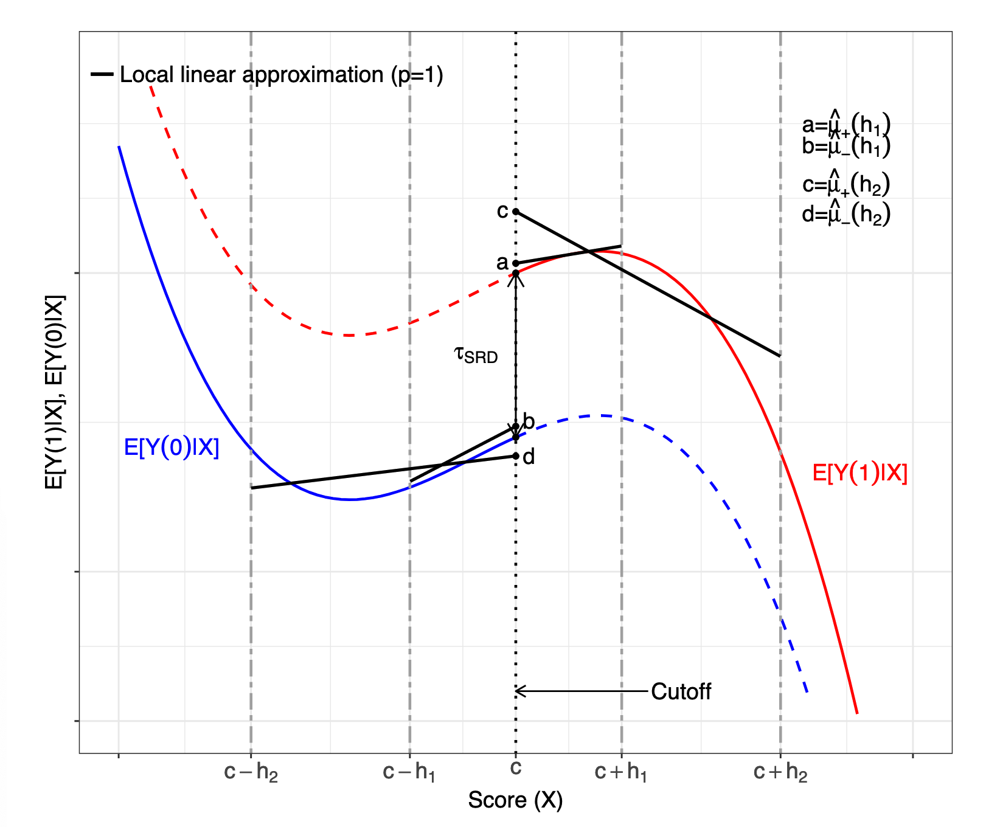

```{r setup, include=FALSE}
options(htmltools.dir.version = FALSE,scipen = 9)
knitr::opts_chunk$set(
  fig.width=9, fig.height=3.5, fig.retina=3,
  out.width = "100%",
  cache = FALSE,
  echo = TRUE,
  message = FALSE, 
  warning = FALSE,
  fig.show = TRUE,
  hiline = TRUE
)
```

```{r xaringan-themer, include=FALSE, warning=FALSE}
library(xaringanthemer)
library(tidyverse)
library(knitr)
library(estimatr)
style_mono_light(base_color = "#003262",
                 base_font_size = "25px")
```

## Announcements 

There is no section on 11/24

There is no class on 11/29 

All outstanding Checkpoints, WP, and PS3 are due next Monday 11/15

---

## RDD Estimation 

RDD estimation presents a variety of design choices

Our discussion is based on the continuity based RD framework 

We are interested in "local" or "non-parametric" fits as opposed to global estimates 

???

Some of these design choices are trivial. Others not so much. It is a good idea as a result to be very open to running additional robustness checks 

---

## What is the local polynomial approach?

Recall that there are (generally) no observations for which the score function exactly equals the cutoff value. 

We use the fact that any sufficiently smooth function is well approximated by some polynomial function up to some small error term 

We will use this point to approximate the regression function near the cutoff


???

The consequence of no observations means that we have to extrapolate or impute a value.

Because we localize the polynomial fit to the cutoff, this approach is substantially more robust and less sensitive to boundary and overfitting problems. Because we are close to the cutoff we depend crucially on accuracy of the approximation near the cutoff which is controlled by the size of the bandwidth around the local polynomial fit. 

---

## Local Polynomial Point Estimation 

Choose a polynomial order *p* and a kernel function $K()$ 

Choose a bandwidth *h*

Above cutoff fit a WLS regression of the outcome on a constant and weighted coefficients. 

$$\hat{\mu_{+}} + \hat{u_{+,1}}(X_i - c) + ....+ \hat{u_{+,1}}(X_i - c)^p$$ 

The result of the intercept from this regression is an estimate of the $\mu_{+} = E[Y_i(1)|X_i = c]$

???

a polynomial order is how many polynomials we are interested in

a kernel function is a weighting function for observations. There are different kinds. In your WP you fit a uniform and a triangular kernel function. There are others. 

---

## Local Polynomial Point Estimation 

For observations below the cutoff we do the same thing but our estimate of interest is the estimated intercept of the local weighted regression $\mu_{-} = E[Y_i(1)|X_i = c]$

Finally, we simply subtract one number from another to get our Sharp RD point estimate 

$$\hat{tau} = \mu_{+} - \mu_{-}$$

Thus there are three design choices: the kernel function, the polynomial order, and the bandwidth 

???

Note here that these are design choices, but also choices that fundamentally depend on the data. We want to have a good fit with our data, and we need to have the data to do that. Thus, RDs might be quite sensitive to these choices 


---

## Choosing the Kernel Function 

A kernel function assigns non-negative weights to each transformed observation $\frac{X_i - c}{h}$ based on the distance between the observation's score and the cutoff. 

Cattaneo *et al* recommend using the triangular kernel function because it has optimal properties for the point estimation. 

We also fit a uniform kernel because a uniform kernel is equivalent to simple OLS without weights using only observations within the bandwidth


???

A triangular kernel assigns zero weight to all observations with a score outside our bandwidth interval and positive weights to all observations within the interval. That means that the weight will be maximized at the cutoff value, and declines (like a triangle!) symmetrically and linearly as the value of the score moves away from the cutoff 

A uniform kernel minimizes the asymptotic variance of the local polynomial estimator under some conditions. It assigns zero weight to observations outside our bandwidth, but equal weight to all observations inside. 

Estimation should not be very sensitive to kernel estimation, which you saw in the weekly practice (WP)

---

## Local polynomial order 

Local polynomial order will determine how the line looks in the estimation function. 

A zero order polynomial should not be fit because it has bad technical properties. Higher order polynomials lead to concerns about overfitting. 

For a given approximation increasing the polynomial order increases the accuracy but also increases variability 

Local linear estimators as implemented by `rdrobust` provide the best trade-off 

---

## Bandwidth selection 

The bandwidth controls the width of the neighborhood around the cutoff that we use to fit our local polynomials to approximate an unknown regression function. 

Arguably this is the most consequential decision for an RD design. 

Choosing a smaller bandwidth reduces misspecification error but increases variance of the coefficients. Why?

???

The choice of h (bandwidth) affects the properties of our estimation. Consider the triangular kernel here. Different bandwidths will lead to different lines away from the cutoff. Empirical findings are extremely sensitive to bandwidth 

The answer to why is that as we make the bandwidth smaller we lose observations. Fewer observations leads to increased variance. A larger h will result in more smoothing bias if the unknown function differs considerably from the polynomial model used for approximation but reduces the variance because we have more observations. This is the "Bias-Variance" trade off in an RD

---

## Bias in Local Approximations 
```{r,echo=F, out.width="50%", fig.align='center'}

```
???

This figure illustrates how the error in the approximation is directly related to the bandwidth choice. The unknown regression functions in the figure, E[Yi(1)|Xi = x] and E[Yi(0)|Xi =x], have considerable curvature. At first, it would seem inappropriate to approximate these functions with a linear polynomial. Indeed, inside the interval [c−h2,c+ h2], a linear approximation yields an estimated RD effect equal to ˆμ+(h2) − ˆμ−(h2) (distance between points c and d), which is considerably different from the true effect τSRD. Thus, a linear fit within bandwidth h2 results in a poor approximation because of misspecification error. However, reducing the bandwidth from h2 to h1 improves the linear approximation considerably, as now the estimated RD effect ˆμ+(h1) − ˆμ−(h1) (distance between points a and b) is much closer to the population treatment effect τSRD. The reason is that the regression functions are nearly linear in the interval [c−h1,c+ h1], and therefore the linear approximation results in a smaller misspecification error when the bandwidth shrinks from h2 to h1. This illustrates the general principle that, given a polynomial order, the accuracy of the approximation can always be improved by reducing the bandwidth

---

## Bandwidth Selection 

How should we select *h*? The current practice is to balance the bias-variance tradeoff by minimizing the MSE of the local polynomial RD point estimator 

$$MSE_{\tau} = \textbf{B}^2 + V = h^{2(p+1)}B + \frac{V}{nh}$$ 
We choose a bandwidth that minimizes that function. Refer to Cattaneo *et al* for the formula. `rdrobust` does this for us which is why we're teaching it. 

???

The quantities B and V represent the leading bias and variance of the RD point estimates. The general form of these bias are related the curvature of the unknown regression function for treatment and control units. The bias depends on the (p + 1)th derivative of the regression function with respect to the running variable. 

The variance terms captures the conditional variability of the outcome given the score at the cutoff for treatment and control units. As the number of observations near the cutoff decreases (the density function decreases) the contribution of variance to MSE increases and vice versa as the number of observations near the cutoff increases. 

---

## Point Estimation in Practice 

Suppose we have a dataset with an outcome *Y* and a forcing variable *X* 

```{r, eval = F}
c <- 0 # normalized cut off 
h <- val # some bandwidth value 
low <- lm(Y[X < c+h & X >= c - h] ~ X[X < c+h & X>= c + h])
left_intercept <- left$coefficients[1]

upp <- lm(Y[X > c+h & X =< c - h] ~ X[X > c+h & X <= c + h])
right_intercept <- upp$coefficients[1]
tau <- right_intercept - left_intercept 
```

???

Here we use standard OLS to show that a uniform kernel is equivalent. We simply have a WLS fit within a bandwidth. Our bandwidth is some arbitrary value and we construct the local linear RD point estimation which excludes all observations outside the bandwidth and gives all observations inside this interval equal weight. 
---

## Point Estimation in Practice 

We can actually get the same point estimator be fitting a single linear regression that includes an interaction between treatment and score. 

These are algebraically equivalent 

```{r, eval = F}
T_X = X*Z
m <- lm(Y[X >= c-h & X <= c + h] ~ X[X >= c-h & X <= c + h]) + 
  Z[X >= c-h & X <= c + h] + T_X[X >= c - h & X <= c + h]
summary(m)

```

---

## Point Estimation in Practice 

What about a triangular weighting scheme as recommended?

```{r, eval = F}
w <- NA 
w[X < c- h & X >= -(c-h)] = 1 - abs(X[X < c-h & X >=-(c-h)]/(c+h))
w[X >= c- h & X <= (c+h)] = 1 - abs(X[X >= c-h & X <= c+h]/(c+h))

## Put them into OLS 
m2 <- lm(Y[X<c-h]~X[X < c-h], weights = w[X < c-h])
m3 <- lm(Y[X >= c-h]~X[X>=c-h], weights = w[X>=c-h])
tau <- m3$coefficients[1] - m2$coefficients[1]

```

???

This illustrates how to get the point estimates by hand. The standard error calculations are going to be wrong, so we use rdrobust to solve this problem for us. 

---

## Point Estimation in Practice 

```{r, eval = F}
out <- rdrobust(Y, X, kernel = "triangular", p = 1, bwselect = "mserd")
summary(out)

```

???

We use rdwbselect from the package to select an MSE optimal bandwidth for the local linear estimator of tau. This will depend on the choice of polynomial order and kernel function. the mserd indicates that we want a bandwidth that MSE optimal. The output here will report the coefficient, appropriate standard errors, p values, and confidence intervals. These confidence intervals are robust. For the specific mathemetics, consult Cattaneo et al 4.3 

---

## What about covariates 

Our approach here is non-parametric. That means that in order to be consistent with this approach our covariates must be balanced at the cutoff 

Covariate adjustment will not restore identification of the standard RD design when treated and control units differ systematically at the cutoff 

This is the empirical test that previous papers we have discussed (e.g. Mello 2019) failed when considering the RD specification 

With appropriate covariates, our estimates will have increased precision. 

---

## What about covariates 

```{r, eval = F}
# Assume C is a column matrix of covariates 
out_c <- rdrobust(Y, X, covs = C, 
                  kernel = "triangular", p = 1, 
                  bwselect = "mserd")

# Will clustering 
out_cl <- rdrobust(Y, X, covs = C, 
                   kernel = "triangular", p = 1, 
                   bwselect = "mserd", cluster = cluster_var)

```

???

We should get roughly the same RD point estimate from including covariates if the included covariates are truly predetermined but the inclusion of covariates will decrease the size of the confidence intervals which will mechanically reduce the p-values. 

