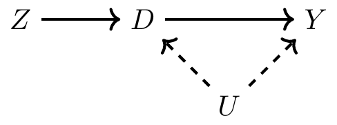

```{r setup, include=FALSE}
options(htmltools.dir.version = FALSE,scipen = 9)
knitr::opts_chunk$set(
  fig.width=9, fig.height=3.5, fig.retina=3,
  out.width = "100%",
  cache = FALSE,
  echo = TRUE,
  message = FALSE, 
  warning = FALSE,
  fig.show = TRUE,
  hiline = TRUE
)
```

```{r xaringan-themer, include=FALSE, warning=FALSE}
library(xaringanthemer)
library(tidyverse)
library(knitr)
library(estimatr)
style_mono_light(base_color = "#003262",
                 base_font_size = "25px")
```

## Announcements 

There is no section on 11/24

There is no class on 11/29 

All outstanding Checkpoints, WP, and PS3 are due today 

WP10 and Checkpoint 13 are due on Friday

---

## Last Week 

Last week we discussed Regression Discontinuities 

We noted that there were two kinds of RDDs: Sharp and Fuzzy 

I put off discussing Fuzzy RDDs other than to say that they are estimated with Instrumental Variables

???

n the sharp RDD, treatment was determined when Xi≥c0. But that kind of deterministic assignment does not always happen. Sometimes there is a discontinuity, but it’s not entirely deterministic, though it nonetheless is associated with a discontinuity in treatment assignment. When there is an increase in the probability of treatment assignment, we have a fuzzy RDD. 
---

## What are we doing this week?

This week we will cover Instrumental Variables (IVs)

We have seen IVs before in class in the context of RCTs 

Our focus this week will be on their application in observational studies 

---

## IV Intuition 

```{r, fig.align='center', echo = F}

```

???

First, notice the backdoor path between D and Y: D←U→Y. Furthermore, note that U is unobserved by the econometrician, which causes the backdoor path to remain open. If we have this kind of selection on unobservables, then there does not exist a conditioning strategy that will satisfy the backdoor criterion (in our data). But, before we throw up our arms, let’s look at how Z operates through these pathways.
 
First, there is a mediated pathway from Z to Y via D. When Z varies, D varies, which causes Y to change. But, even though Y is varying when Z varies, notice that Y is only varying because D has varied. You sometimes hear people describe this as the “only through” assumption. That is, Z affects Y “only through” D.

Imagine this for a moment though. Imagine D
consists of people making choices. Sometimes these choices affect Y, and sometimes these choices are merely correlated with changes in Y due to unobserved changes in U. But along comes some shock, Z, which induces some but not all of the people in D to make different decisions. What will happen?

Well, for one, when those people’s decisions change, Y
will change too, because of the causal effect. But all of the correlation between D and Y in that situation will reflect the causal effect. The reason is that D is a collider along the backdoor path between Z and Y.

But I’m not done with this metaphor. Let’s assume that in this D
variable, with all these people, only some of the people change their behavior because of D. What then? Well, in that situation, Z is causing a change in Y for just a subset of the population. If the instrument only changes the behavior of women, for instance, then the causal effect of D on Y will only reflect the causal effect of women’s choices, not men’s choices.
---

## IV Intuition 

```{r, fig.align='center', echo = F}

```

???

There are two ideas inherent in the previous paragraph that I want to emphasize. First, if there are heterogeneous treatment effects (e.g., men affect Y differently than women do), then our Z shock only identified some of the causal effect of D on Y. And that piece of the causal effect may only be valid for the population of women whose behavior changed in response to Z; it may not be reflective of how men’s behavior would affect Y. And second, if Z is inducing some of the change in Y via only a fraction of the change in D, then it’s almost as though we have less data to identify that causal effect than we really have.

Here we see two of the difficulties in interpreting instrumental variables and identifying a parameter using instrumental variables. Instrumental variables only identify a causal effect for any group of units whose behaviors are changed as a result of the instrument. We call this the causal effect of the complier population; in our example, only women “complied” with the instrument, so we only know its effect for them. And second, instrumental variables are typically going to have larger standard errors, and as such, they will fail to reject in many instances if for no other reason than being underpowered.

Moving along, let’s return to the DAG. Notice that we drew the DAG such that Z is independent of U. You can see this because D is a collider along the Z→D←U path, which implies that Z and U are independent. This is called the “exclusion restriction,” which we will discuss in more detail later. But briefly, the IV estimator assumes that Z is independent of the variables that determine Y except for D.

Second, Z is correlated with D, and because of its correlation with D (and D’s effect on Y), Z is correlated with Y but only through its effect on D. This relationship between Z and D is called the “first stage” because of the two-stage least squares estimator, which is a kind of IV estimator. The reason it is only correlated with Y via D is because D is a collider along the path Z→D←U→Y.

---

## Instrumental Variables Requirements 

1. The instrument must be relevant 

2. The instrument must only affect the outcome (Y) through the treatment (D). 

$$Y_i(D_i(Z_i), Z_i) = Y_i(D_i(Z_i))$$

We tend to call IVs Z. If we assume monotonicty, then we get a LATE. Why?

???

Relevance means that the instrument has some correlation with the treatment. 

The second one we've seen before. It's an exclusion restriction. 

For our discussion, we're often going to assume that we have a binary instrument and we will start by not thinking about other covariates. 
---

## What does an IV identify?

An IV strategy non-parametrically identifies the effect of a treatment for those who respond to the treatment

Monotonicity matters because it means that all of the respondents go in one direct (no defiers!)

---

## The exclusion restriction 

Instrumental relevance is easy to test. Run a correlation between the treatment and the instrument. 

The exclusion restriction is fundamentally untestable. 

Basically everything about an IV conceptually comes down to whether or not we believe the exclusion restriction. 

---

## The exclusion restriction: Rain Rain Go Away

We are often interested in why people fight each other. One possibility is that economic deprivation leads to conflict. What's the regression here?

Problem: economic growth is endogenous!

Solution?: Use annual changes in rainfall as an instrument for economic growth (Miguel 2004)

???

Income is endogenous to conflict and rainfall is a plausible candidate instrument because a country's economy may be economically dependent on rain fed agriculture. This is true throughout many parts of the world, including sub-saharan africa and India. 

The critical assumption of the IV is that rainfall only affects conflict only through its impact on income. 
---

## The exclusion restriction: Rain Rain Go Away

Y: Conflict 

D: Income 

Z: rainfall 

Rainfall is plausibly random. What's the problem?

???

Rainfall works because there is a positive correlation between percentage change in rainfall over the previous year and economic growth. Rainfall might also be plausibly independent of the error term. We can actually assume that rainfall is exogenous in this discussion because that's not the problem for the exclusion restriction. 
---

## The exclusion restriction: Rain Rain Go Away

```{r, echo = F, fig.align='center'}


```

???

A critical assumption underlying the use of rainfall as an IV is that
rainfall affects conflict only through its impact on income. Sarsons (2015) uses heterogeneity in the effect of rainfall on income in India to test this assumption. India has seen substantial investment in irrigation infrastructure over the past 50 years, primarily in the form of irrigation dams. 

These dams protect against weather shocks, providing districts
downstream of the dam with water during droughts and holding excess rainwater during periods of heavy rainfall. Sarsons identify districts that are downstream of dams (dam-fed districts) and find that while agricultural production in rain-fed districts (those upstream of a dam) is dependent on rainfall, production in dam-fed districts is uncorrelated with the amount of rain. Yet despite having little influence on production in these districts, rainfall still predicts riot incidence, suggesting that rainfall affects conflict through some other channel.

---

## The exclusion restriction 

Even with a variable that is near random the exclusion restriction may not be satisfied 

IV require lots of theory and thinking ahead of time. This also should include what implications might be testable if the exclusion restriction *was* violated 

Mathematically, we know that the bigger the complier group the less bias will matter if there is a violation of the exclusion restriction

---

## Revisiting Monotonicity (de Chaisemartin 2017)

Monotonicity can fail in the observational world: 

1. Examiner designs 

2. Sibling-sex composition 

3. Encouragement designs 

???

Examiner designs: Imagine you have two judges who
decide guilty/not guilty, and you randomly assign them. If
monotonicity means that one judge is always stricter (for
every person), then monotonicity holds. However, easy to
envision failures of this (e.g. strictness on different crimes,
different types of people)

2. Sibling-sex composition: Angrist Evan (1998) uses two
siblings of same sex as instrument for third child, b/c more
likely to have a third child. But, some families may want
two boys, vs. two girls. Same sex composition could
generate defiers. Twin births are often construed as a natural experiment in the social and natural sciences on the premise that the occurrence of twins is quasirandom. We present population-level evidence that challenges this premise. Using individual data for 17 million births in 72 countries, we demonstrate that indicators ofmother’s health, health-related behaviors, and the prenatal environment are systematically positively associated with twin birth. The
associations are sizable, evident in richer and poorer countries—evident even among women who do not use in vitro fertilization—and hold for numerous different measures of health. We discuss potential mechanisms, showing evidence that favors selective miscarriage.

3. Encouragement designs may backfire if the nudge is too
heavy-handed (Duflo and Saez (2003))

---

## For next time

We are going to dive into the details of estimation next time 

After Wednesday you should have a conceptual idea of what `iv_robust()` is doing

