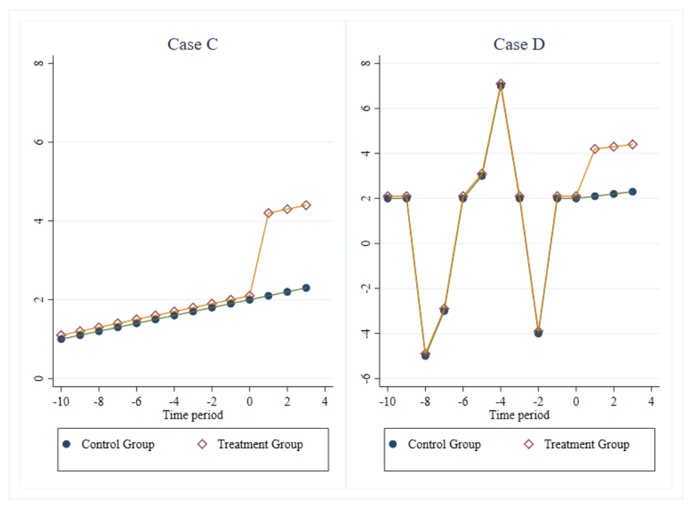

```{r setup, include=FALSE}
options(htmltools.dir.version = FALSE,scipen = 9)
knitr::opts_chunk$set(
  fig.width=9, fig.height=3.5, fig.retina=3,
  out.width = "100%",
  cache = FALSE,
  echo = TRUE,
  message = FALSE, 
  warning = FALSE,
  fig.show = TRUE,
  hiline = TRUE
)
```

```{r xaringan-themer, include=FALSE, warning=FALSE}
library(xaringanthemer)
library(tidyverse)
library(knitr)
library(estimatr)
library(kableExtra)
library(here)
library(ggthemes)
library(lfe)
library(xaringan)
library(patchwork)
library(bacondecomp)
library(multcomp)
library(fastDummies)
library(magrittr)
style_mono_light(base_color = "#003262",
                 base_font_size = "25px")
```

## Announcements 

There is no class or section on 11/24 (Happy Holidays)

There is no class on 11/29 

WP10 and Checkpoint 13 redos are due on 11/24 

PS5 Makeups are due today 

Extended lecture slides for Wednesday will be up on bCourses

---

## Differences in Differences 

We have been thinking in class about situations where we have random assignment. 

Sometimes though treatment and control outcomes move in parallel in the absence of treatment. 

The divergence of a post-treatment path may signal a treatment effect. 

**This argument** is the heart of Differences in differences (DiD)


---

## Differences in Differences 

```{r, echo = F}
data <- tibble(
  Y = c(2, 5, 1, 2),
  Unit = c("Treat", "Treat", "Control", "Control"),
  T = c(0, 1, 0, 1)
)
# plot
data %>% 
  ggplot(aes(x = T, y = Y, group = Unit, color = Unit)) + geom_line(size = 2) + 
  labs(x = "Time", y = "Outcome") + 
  scale_x_continuous(breaks = c(0, 1)) + 
  scale_colour_brewer(palette = 'Set1') + 
  theme(axis.title = element_text(size = 18),
        axis.text = element_text(size = 16),
        legend.position = 'bottom',
        legend.title = element_blank(),
        legend.text = element_text(size = 16),
        plot.background = element_blank())
```

---
## Differences in Differences 

Consider the simplest case where we have two units and two periods. 

We have some intervention D and our goal is to estimate the effect of treatment. 

|Unit|Outcome|
|----|-------|
|A|Y = A + D|
|B|Y = B|

Is it reasonable to just say that the difference as stated is causal? 

???

Let’s represent now the differences between Lambeth and Southwark and Vauxhall with fixed level differences, or fixed effects, represented by L and SV. Both are unobserved, unique to each company, and fixed over time. What these fixed effects mean is that even if Lambeth hadn’t changed its water source there, would still be something determining cholera deaths, which is just the time-invariant unique differences between the two companies as it relates to cholera deaths in 1854.

When we make a simple comparison between Lambeth and Southwark and Vauxhall, we get an estimated causal effect equalling D+(L−SV). Notice the second term, L−SV. We’ve seen this before. It’s the selection bias we found from the decomposition of the simple difference in outcomes from earlier in the book.
---

## Differences in Differences 

Suppose we just compare a unit to itself 

|Unit|Outcome|
|----|-------|
|Before|Y = A|
|After|Y = A + (Time + D)|

This procedure eliminates the fixed effects of unit A but doesn't give an unbiased estimate of the treatment effect. 

There are natural changes that are happening just due to time! 
---
## Differences in Differences 

Let's combine the two simple strategies together 

|Unit|Time Period|Outcome|Diff 1|
|----|-----------|-------|-----|
|A|Before|Y = A|||
|A|After|Y = A + T + D|T+D|
|B|Before|Y = B||
|B|After|Y = B + T|T|

Once we difference out the before and after for each group, and then take the differences we get back an unbiased estimator of *D*

---
## Differences in Differences 

```{r d2, echo = FALSE, fig.align = 'center', fig.width = 10, cache = TRUE}
data %>% 
  group_by(Unit) %>% 
  mutate(Y2 = Y - Y[which(T == 0)]) %>% 
  ggplot(aes(x = T, y = Y, group = Unit, color = Unit)) + 
  geom_line(size = 2) + 
  geom_line(aes(x = T, y = Y2, group = Unit, color = Unit), linetype = "dashed", size = 2) + 
  labs(x = "Time", y = "Outcome") + 
  scale_x_continuous(breaks = c(1, 2)) +
  scale_colour_brewer(palette = 'Set1') + 
  theme(axis.title = element_text(size = 18),
        axis.text = element_text(size = 16),
        legend.position = 'bottom',
        legend.title = element_blank(),
        legend.text = element_text(size = 16),
        plot.background = element_blank()) + 
  annotate("label", y = 2, x = 0.85, label = "Treatment \n Effect") + 
  annotate("segment", x = 1, xend = 1, y = 1, yend = 3, color = "black", size = 1) + 
  annotate("segment", x = 0.92, xend = 1, y = 2, yend = 3, color = "black", 
           linetype = "dashed", size = 2) + 
  annotate("segment", x = 0.92, xend = 1, y = 2, yend = 1, color = "black", 
           linetype = "dashed", size = 2) + 
  annotate("segment", x = 0, xend = 0, y = 2, yend = 0, color = "#377EB8", 
           arrow = arrow(length = unit(0.1, "inches")), size = 2) + 
  annotate("segment", x = 0.5, xend = 0.5, y = 1.5, yend = 0.5, color = "#E41A1C", 
           arrow = arrow(length = unit(0.1, "inches")), size = 2)
```

---

## Parallel Trends 

The parallel trends assumptions is the key assumption in any DiD design. 

Informally, there is no time varying differences that exist between the two groups *other* than the treatment assignment. 

This is fundamentally untestable! 

???

We are assuming that there is no time-variant company specific unobservables. Nothing unobserved in Lambeth households that is changing between these two periods that also determines cholera deaths. This is equivalent to assuming that T is the same for all units. And we call this the parallel trends assumption. We will discuss this assumption repeatedly as the chapter proceeds, as it is the most important assumption in the design’s engine. If you can buy off on the parallel trends assumption, then DD will identify the causal effect.

---

## DiD Decomposition 

Our estimator $\delta$ is 

$$\delta = (E[Y_t|Post] - E[Y_t|Pre]) - (E[Y_u|Post] - E[Y_u|Pre])$$

This equation yields the ATT for the treatment group. 


???

Here we have a treatment group and an untreated group. There is a pre period for both groups and what we are getting is the ATT for group k 
---

## DiD Decomposition

We can use a trick where we just add and subtract a term to this equation. 

$$\delta = (E[Y_t(1)|Post] - E[Y_t(0)|Pre]) - (E[Y_u(0)|Post] -\\ E[Y_u(0)|Pre]) + (E[Y_t(0)|Post] - E[Y_t(0)|Post]$$

Rearrange terms: 

$$\delta = (E[Y_t(1)|Post] - E[Y_t(0)|Post]) + [(E[Y_u(0)|Post] -\\ E[Y_u(0)|Pre]) + (E[Y_t(0)|Post] - E[Y_t(0)|Post]$$ 

This yields the ATT + SB for non-parallel trends! 

???

Now, let’s study this last term closely. This simple 2×2 difference-in-differences will isolate the ATT (the first term) if and only if the second term zeroes out. But why would this second term be zero? It would equal zero if the first difference involving the treatment group, k, equaled the second difference involving the untreated group, U

.

But notice the term in the second line. Notice anything strange about it? The object of interest is Y0, which is some outcome in a world without the treatment. But it’s the post period, and in the post period, Y=Y1 not Y0 by the switching equation. Thus, the first term is counterfactual. And as we’ve said over and over, counterfactuals are not observable. This bottom line is often called the parallel trends assumption and it is by definition untestable since we cannot observe this counterfactual conditional expectation. We will return to this again, but for now I simply present it for your consideration.

---

## Regression and DiD 

We can estimate the DiD equation from the last slide with a linear regression. 

$$Y_{it} = \alpha + \beta_1 D_i + \beta_2 POST_t + \delta(D_i*POST_t)$$

The advantage of this form is that we get estimate of our treatment effect and standard errors. 

We can also easily add covariates to this model, which we practically will always want to do because we are in a selection on observables world

???

Under the simple DID, the untreated potential outcome is Y (0)gt = β0 + β1Tg + β2Pt + gt . In the absence of treatment, the average outcome in group 1 is β0 in period 1 and β0 + β2 in period 2. Likewise, the average untreated outcome in group 2 is equal to β0 + β1 in period 1 and β0 + β1 + β2 in period 2. Under the common trend assumption, the coefficient on Tg captures the time-invariant difference in outcomes between the two groups. Implicitly, the group coefficient captures the combined effects of all unmeasured covariates that differ systematically between the two groups and that do not change over the course of the study period. In a similar manner, the coefficient on Pt captures the combined effects of any unmeasured covariates that change between the two periods but affect
outcomes the same way in both groups. In practice, researchers call β1 the group effect and β2 the time trend.

---
## Assumptions of DiD 

Parellel Trends: $E[Y0(2)−Y0(1)∣A=1]=E[Y0(2)−Y0(1)∣A=0]$

Consistency: The treatment status of a unit can vary over time but once a unit is treated we observes the potential outcome under treatment. Additionally future treatment does not affect past outcomes. 

Positivity: $0<P(A=1|X)<1$ for all X
---

## How to assess parallel trends

"The squiggly line test" (McKenzie 2021)

Plot the raw treatment and control series and not just their differences. The longer and squigglier the pre-treatment trends, the more plausible parallel trends should be. 

```{r, echo = F, fig.align='center', out.width="50%"}

```

???

Rather than just asserting that parallel trends hold, or abandoning projects where a pre-test rejects parallel trends, these new papers focus on thinking carefully about what sort of violations of parallel trends are plausible, and examining robustness to these.  Importantly, these methods should be used when there is reason to be skeptical of parallel trends ex ante, regardless of the outcome of a test of whether parallel trends hold pre-intervention.  This type of sensitivity analysis will allow one to get bounds on likely treatment effects

But notice that this rhetoric is a kind of proof by assertion. Just because they were similar before does not logically require they be the same after. Assuming that the future is like the past is a form of the gambler’s fallacy called the “reverse position.” Just because a coin came up heads three times in a row does not mean it will come up heads the fourth time—not without further assumptions. Likewise, we are not obligated to believe that that counterfactual trends would be the same post-treatment because they had been similar pre-treatment without further assumptions about the predictive power of pre-treatment trends. But to make such assumptions is again to make untestable assumptions, and so we are back where we started.

One situation where parallel trends would be obviously violated is if the treatment itself was endogenous. In such a scenario, the assignment of the treatment status would be directly dependent on potential outcomes, and absent the treatment, potential outcomes would’ve changed regardless. Such traditional endogeneity requires more than merely lazy visualizations of parallel leads. While the test is important, technically pre-treatment similarities are neither necessary nor sufficient to guarantee parallel counterfactual trends
---


## Informal Line test is not fool proof 

```{r, echo = F, fig.align='center', out.width="65%"}

```

???

In addition, what we would like to establish is not that there were parallel trends in the pretreatment period, but rather that there would have been in the post-period in the absence of the treatment, something which is unfortunately unknowable. A parallel trend in the periods prior to treatment does not guarantee that a parallel trend would have continued in the absence of treatment. The researcher should consider whether there is reason to believe this pattern would
have continued. This requires understanding why the groups diverged in levels but otherwise followed similar trends, in other words, a good understanding of the subject matter.

It is tempting to begin hypothesizing about what caused the
sudden break from the common trend at roughly T = 160. The two groups in Figure 1 are males (the control group) and females (the experimental group). We have plotted average height in centimeters against age measured in months. For reasons that we well understand (or at least we would if we had studied enough biology), height first diverges between the sexes when females hit puberty and then diverges in the opposite direction when males hit puberty at a later age. Despite exhibiting parallel trends in height prior to T = 135, male and female height should not be expected to continue at the same
rate of growth.

We are confident that no economics journal would publish
our fictional study, but we are less confident that they do not
publish well-intended research on complicated psychological
or social phenomena based on a belief in the superiority of
economists’ statistical methods for uncovering causal effects.
---

## Inference in DiD 

In the two period case, standard errors work like we expect them to. 

Often though we have lots of periods. e.g (Paglayan 2018)

Methods for getting appropriate errors (Bertrand, Duflo, Mullainathan 2004):

1) Block bootstrapping 

2) Aggregation 

3) Clustering 

???

If the block is a state, then you simply sample states with replacement for bootstrapping. Block bootstrap is straightforward and only requires a little programming involving loops and storing the estimates. As the mechanics are similar to that of randomization inference, I leave it to the reader to think about how they might tackle this.

This approach ignores the time-series dimensions altogether, and if there is only one pre and post period and one untreated group, it’s as simple as it sounds. You simply average the groups into one pre and post period, and conduct difference-in-differences on those aggregated. But if you have differential timing, it’s a bit unusual because you will need to partial out state and year fixed effects before turning the analysis into an analysis involving residualization. Essentially, for those common situations where you have multiple treatment time periods (which we discuss later in greater detail), you would regress the outcome onto panel unit and time fixed effects and any covariates. You’d then obtain the residuals for only the treatment group. You then divide the residuals only into a pre and post period; you are essentially at this point ignoring the never-treated groups. And then you regress the residuals on the after dummy. It’s a strange procedure, and does not recover the original point estimate, so I focus instead on the third.

Correct treatment of standard errors sometimes makes the number of groups very small: in Card and Krueger (1994), the number of groups is only two. More common than not, researchers will use the third option (clustering the standard errors by group). I have only one time seen someone do all three of these; it’s rare though. Most people will present just the clustering solution—most likely because it requires minimal programming.

For clustering, there is no programming required, as most software packages allow for it already. You simply adjust standard errors by clustering at the group level, as we discussed in the earlier chapter, or the level of treatment. For state-level panels, that would mean clustering at the state level, which allows for arbitrary serial correlation in errors within a state over time. This is the most common solution employed.
