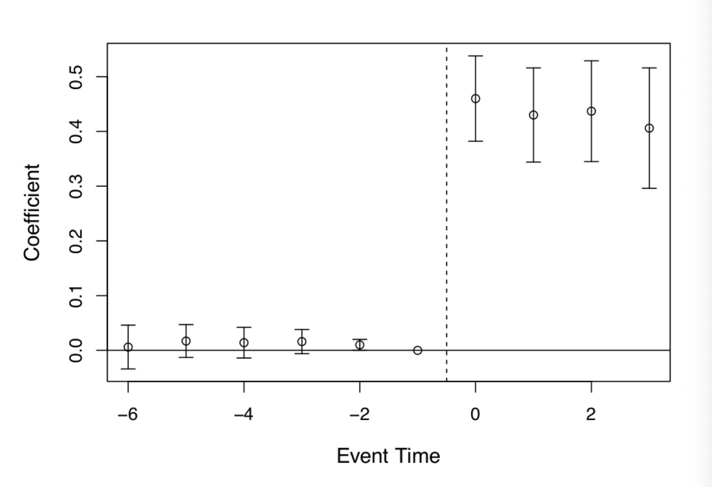
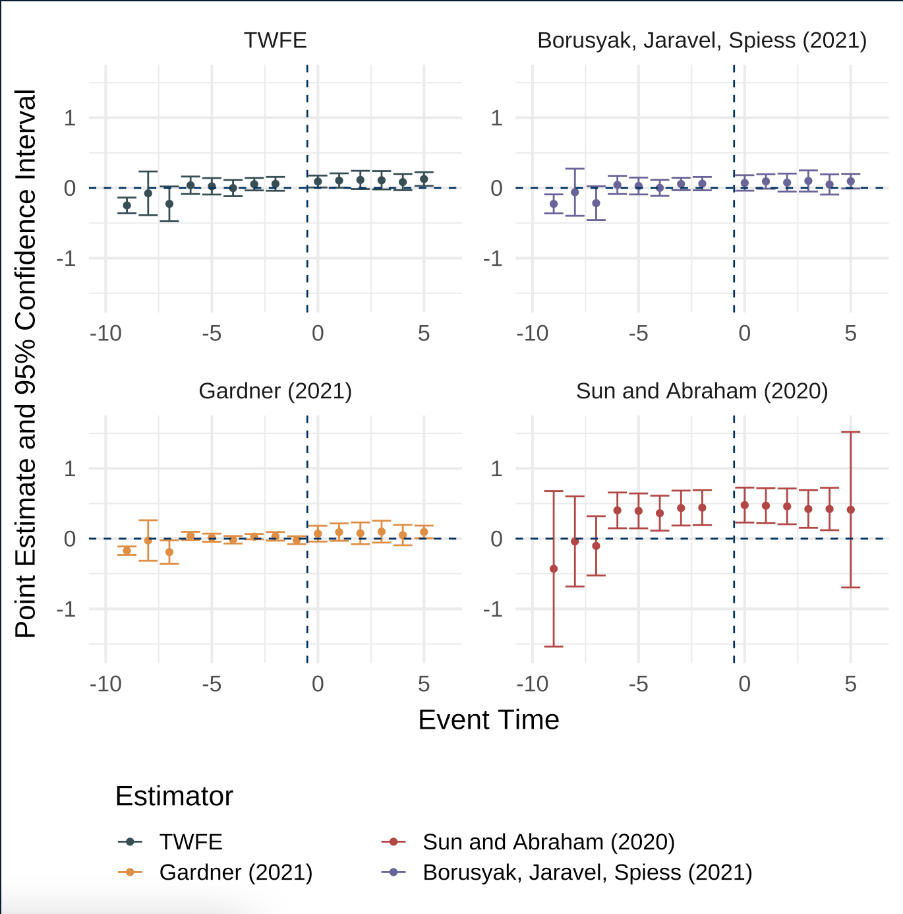

```{r setup, include=FALSE}
options(htmltools.dir.version = FALSE,scipen = 9)
knitr::opts_chunk$set(
  fig.width=9, fig.height=3.5, fig.retina=3,
  out.width = "100%",
  cache = FALSE,
  echo = TRUE,
  message = FALSE, 
  warning = FALSE,
  fig.show = TRUE,
  hiline = TRUE
)
```

```{r xaringan-themer, include=FALSE, warning=FALSE}
library(xaringanthemer)
library(tidyverse)
library(knitr)
library(estimatr)
library(kableExtra)
library(here)
library(ggthemes)
library(lfe)
library(xaringan)
library(patchwork)
library(bacondecomp)
library(multcomp)
library(fastDummies)
library(magrittr)
style_mono_light(base_color = "#003262",
                 base_font_size = "25px")
```

## Parallel Trends Redux 

Recall that we our 2x2 DiD design is the ATT + selection bias. 

Parallel trends allows us to eliminate the SB term 

$$[E[Y^0_T|Post] - E[Y^0_T|Pre] - E[Y^0_U|Post] - E[Y^0_U|Pre]]$$

This requires us to evaluate a term with a counterfactual, which is why we cannot empirically test the parallel trends assumption

???

So what do we do here, well we can compare placebo pre-treatment leads of the DD coefficient. If DD coefficients in the pre-treatment periods are statistically zero, then the difference-in-differences between treatment and control groups followed a similar trend prior to treatment. And here’s the rhetorical art of the design: if they had been similar before, then why wouldn’t they continue to be post-treatment?

notice that this rhetoric is a kind of proof by assertion. Just because they were similar before does not logically require they be the same after. Assuming that the future is like the past is a form of the gambler’s fallacy called the “reverse position.” Just because a coin came up heads three times in a row does not mean it will come up heads the fourth time—not without further assumptions. Likewise, we are not obligated to believe that that counterfactual trends would be the same post-treatment because they had been similar pre-treatment without further assumptions about the predictive power of pre-treatment trends. But to make such assumptions is again to make untestable assumptions, and so we are back where we started.

---

## Parallel Trends Redux 

Parallel trends is obviously violated if the treatment itself is endogenous. 

Pretreatment parallel trends are not a reason to assume parallel trends in the future. 

It may be helpful to interpret the common trends assumption as a byproduct of a set of underlying variables that differ across states and change over time. 

???

Consider the case of vaccine policy. Instead of asking the abstract question of whether vaccination rates in two states are apt to follow a common time trend absent the policy, we could ask what sorts of (unmeasured) factors likely explain variation in vaccination rates across states and over time, such as parental attitudes. Next, we would ask whether those factors are likely covered by the DID design: Are they time-invariant group attributes or group-invariant time-varying factors? Naming the unmeasured variables that the fixed effects structure is intended to capture is a good way to assess the quality of a DID design, because it
is easier to construct and evaluate arguments for and against specific variables than for abstract trends that arise from unknown origins.

---

## Event Study Plots 

While not a direct test of parallel trends, event study plots are often used to show comparability of groups in pre-treatment periods. 

Plotting the raw data year by year runs into problems if the number of treatment groups is large or if units may become treated over time. 

The current way that researchers evaluate pre-treatment dynamics in a situation with differential treatment timing is to estimate a regression model that includes treatment leads and lags. 

$$Y_{its} = \alpha_s + \lambda_t + \sum_{tau = -q}^{-1}\alpha_{\tau}D_{s\tau} + \sum_{\tau = 0}^m \delta_{\tau}D_{s\tau} + x_{ist} + \epsilon_{ist}$$
???

First, it may be cumbersome when the number of treatment groups is large, making it practically impossible. Second, it may not be beautiful. But third, this necessarily assumes that the only control group is the never-treated group, which in fact is not true given what Goodman-Bacon (2019) has shown. Any DD is a combination of a comparison between the treatment and the never treated, an early treated compared to a late treated, and a late treated compared to an early treated. Thus only showing the comparison with the never treated is actually a misleading presentation of the underlying mechanization of identification using an twoway fixed-effects model with differential timing.

---

## Event Study Plots 

```{r,echo=F, fig.align='center', out.width='70%'}

```

???

There are several features of these event studies that should catch your eye. First, look at Figure 9.4. The pre-treatment coefficients are nearly on the zero line itself. Not only are they nearly zero in their point estimate, but their standard errors are very small. This means these are very precisely estimated zero differences between individuals in the two groups of states prior to the expansion.

The second thing you see, though, is the elephant in the room. Post-treatment, the probability that someone becomes eligible for Medicaid immediately shoots up to 0.4 and while not as precise as the pre-treatment coefficients, the authors can rule out effects as low as 0.3 to 0.35. These are large increases in eligibility, and the fact that the coefficients prior to the treatment are basically zero, we find it easy to believe that the risen coefficients post-treatment were caused by the ACA’s expansion of Medicaid in states.

Note that this does not mean that post trends will follow like parallel trends
---

## Event Study Plots 

```{r,echo=F, fig.align='center', out.width='70%'}

```

???

This event study is presented in Figure 9.7. A graph like this is the contemporary heart and soul of a DD design, both because it conveys key information regarding the comparability of the treatment and control groups in their dynamics just prior to treatment, and because such strong data visualization of main effects are powerfully persuasive. It’s quite clear looking at it that there was no difference between the trending tendencies of the two sets of state prior to treatment, making the subsequent divergence all the more striking.

---
## Placebo Tests with DiD 

1. Balance tests are one form of a placebo test. We've just looked at them in the last slide. 

2. Use data on an alternative type of outcome whose value would not be affected by treatment. 

3. Consider different treatment timing and see whether it predicts outcomes. 

Note that these are all similar to Jakiela's TWFE diagnostics

---

## Estimating TWFE with staggered timing

With two periods and two treatment groups, this is just a basic application of a regression model. 

With more than two periods and multiple treatment groups, things get tricky. 

Our usual TWFE is a strange and unintuitive combination of weighted averages from units at different times (Goodman-Bacon 2020). 

???

What we know now is that there are two fundamental problems with the DD design. First, there is the issue of weighting itself. The twoway fixed-effects estimator weights the individual 2×2s in ways that do not make a ton of theoretical sense. For instance, why do we think that groups at the middle of the panel should be weighted more than those at the end? There’s no theoretical reason we should believe that. But as Goodman-Bacon (2019) revealed, that’s precisely what twoway fixed effects does. And this is weird because you can change your results simply by adding or subtracting years to the panel—not just because this changes the 2×2, but also because it changes the variance in treatment itself! So that’s weird.

But this is not really the fatal problem, you might say, with twoway fixed-effects estimates of a DD design. The bigger issue was what we saw in the Bacon decomposition—you will inevitably use past treated units as controls for future treated units, or what I called the “late to early 2×2.” 

This happens both in the event study and in the designs modeling the average treatment effect with a dummy variable. Insofar as it takes more than one period for the treatment to be fully incorporated, then insofar as there’s substantial weight given to the late to early 2×2s, the existence of heterogeneous treatment effects skews the parameter away from the ATT—maybe even flipping signs
---

## Gardner (2021) Estimator 

One possibility is to recognize that under parallel trends, the group and time effects are identified from the subsample of untreated/not-yet-treated observations. Gardner uses this observation to suggest a 2S DiD estimator. 

Stage 1: Estimate the model 

$$Y_{ist} = \alpha_s + \lambda_t + \epsilon_{ist}$$ 

using the subsample of untreated/not-yet-treated observations and form adjusted outcomes $\hat{Y}_{ist} = Y_{ist} - \hat{\alpha}_s - \hat{\lambda}_t$

Stage 2: Regress the adjusted outcomes on treatment status $D^k_{st}$ to estimate treatment effects. 

The coefficient on this parameter in the second stage is the overall ATT or the average treatment effect for all the treated periods

---

## Gardner (2021) Estimator 

Why does this work? 

In a dynamic setting (e.g. staggered treatment timing) the longer a group's treatment duration the more that group is weighted up in a TWFE estimator. 

2SDiD removes the group and period fixed effects that create these weird weights. 

Conceptually, this procedure is simply cleaning out the junk in the TWFE regression that lead it to estimate something other than the ATT. 

---

## Manual Code 

```{r, echo = T, eval = F}
### Run the regression on group and time fixed effects 
### in pre-treatment period
s1 <- lm_robust(Y ~ state + time, data = data %>% 
                  filter(treat == 0))

## Get transformed outcome 
adjusted <- Y - predict(fs, data)

## Run the second stage 
s2 <- lm_robust(adjusted ~ treat, data = data, clusters = cluster)

```

???

There's a technical bit here for inference for which you'd have to adjust the standard errors a bit to deal with the clustering problem that isn't in the first stage
---

## Application Cheng and Hoekstra (2013)

Cheng and Hoekstra are interested in whether "castle doctrine" laws deter crime or escalate violence. 

Castle Doctrine laws are often referred to as "Stand Your Ground" laws. 

The laws allows a person to use lethal force in places other than the home and removed any civil liability that comes from killing a person. They also gave the presumption of reasonable fear to the shooter.

---

## Cheng and Hoekstra (2013)

```{r, echo = F}
did2s::did2s(castle, yname = "l_homicide", treatment = "post", cluster_var = "sid", first_stage = ~0|sid + year, second_stage = ~i(post, ref = F))%>%tidy()%>%
  mutate(term = "Treatment")%>%
  ggplot(aes(y = term, x = estimate))+
  geom_point()+
  geom_vline(xintercept = 0, linetype = 2)+
  geom_errorbarh(aes(xmin = -0.04482, xmax = .17862, height = 0.1))+
  theme_bw()
```

???

Note there are lots of different estimators out here. There's a great R package called did2s that will let us run all of these at once. 


---

## Cheng and Hoekstra Event Study Plots 

```{r, echo = F, fig.align='center', out.width="55%", message = F, warning = F}

```
